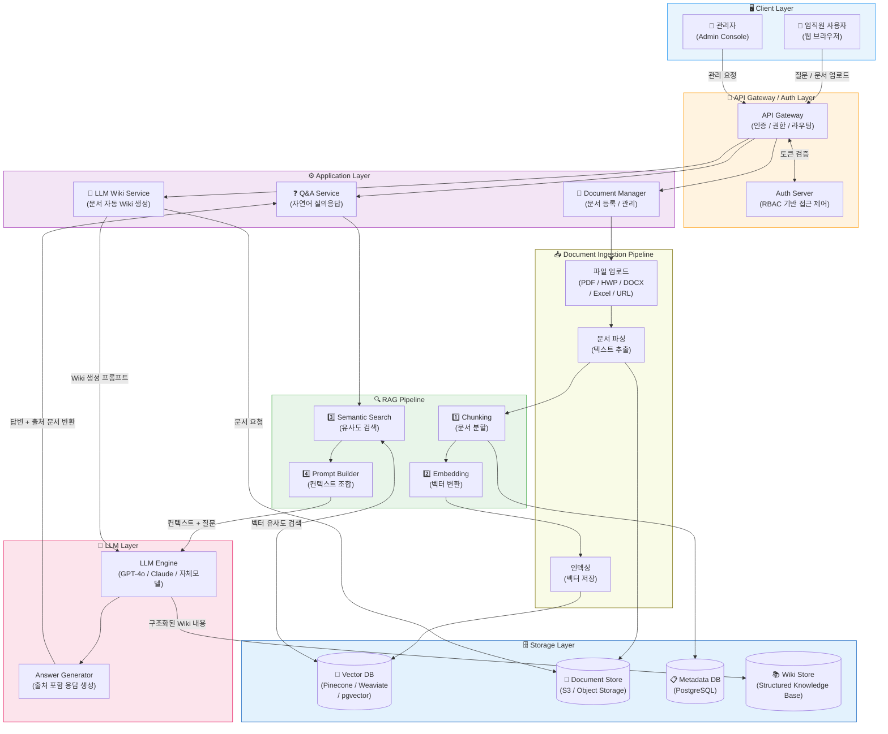

# Weeslee 문서 중앙화 RAG + LLM Wiki 아키텍처

아래 다이어그램은 문서 중앙화 시스템의 전체 구조입니다.

```mermaid
flowchart TB
    subgraph CLIENT["🖥️ Client Layer"]
        U1["👤 임직원 사용자\n(웹 브라우저)"]
        U2["🔧 관리자\n(Admin Console)"]
    end

    subgraph GATEWAY["🔀 API Gateway / Auth Layer"]
        GW["API Gateway\n(인증 / 권한 / 라우팅)"]
        AUTH["Auth Server\n(RBAC 기반 접근 제어)"]
    end

    subgraph APP["⚙️ Application Layer"]
        direction TB
        QA["❓ Q&A Service\n(자연어 질의응답)"]
        WIKI["📖 LLM Wiki Service\n(문서 자동 Wiki 생성)"]
        DOC["📂 Document Manager\n(문서 등록 / 관리)"]
    end

    subgraph RAG["🔍 RAG Pipeline"]
        direction LR
        CHUNK["1️⃣ Chunking\n(문서 분할)"]
        EMBED["2️⃣ Embedding\n(벡터 변환)"]
        SEARCH["3️⃣ Semantic Search\n(유사도 검색)"]
        PROMPT["4️⃣ Prompt Builder\n(컨텍스트 조합)"]
    end

    subgraph LLM_LAYER["🤖 LLM Layer"]
        LLM["LLM Engine\n(GPT-4o / Claude / 자체모델)"]
        RESP["Answer Generator\n(출처 포함 응답 생성)"]
    end

    subgraph STORAGE["🗄️ Storage Layer"]
        VECDB[("🔷 Vector DB\n(Pinecone / Weaviate\n/ pgvector)")]
        DOCDB[("📁 Document Store\n(S3 / Object Storage)")]
        META[("📋 Metadata DB\n(PostgreSQL)")]
        WIKI_STORE[("📚 Wiki Store\n(Structured Knowledge Base)")]
    end

    subgraph INGEST["📥 Document Ingestion Pipeline"]
        direction LR
        UPLOAD["파일 업로드\n(PDF / HWP / DOCX\n/ Excel / URL)"]
        PARSE["문서 파싱\n(텍스트 추출)"]
        INDEX["인덱싱\n(벡터 저장)"]
    end

    U1 -->|"질문 / 문서 업로드"| GW
    U2 -->|"관리 요청"| GW
    GW <-->|"토큰 검증"| AUTH

    GW --> QA
    GW --> WIKI
    GW --> DOC

    DOC --> UPLOAD --> PARSE --> CHUNK --> EMBED --> INDEX
    INDEX --> VECDB
    PARSE --> DOCDB
    CHUNK --> META

    QA --> SEARCH
    SEARCH <-->|"벡터 유사도 검색"| VECDB
    SEARCH --> PROMPT
    PROMPT -->|"컨텍스트 + 질문"| LLM
    LLM --> RESP
    RESP -->|"답변 + 출처 문서 반환"| QA

    WIKI -->|"문서 요청"| DOCDB
    WIKI -->|"Wiki 생성 프롬프트"| LLM
    LLM -->|"구조화된 Wiki 내용"| WIKI_STORE

    style CLIENT fill:#e8f4fd,stroke:#2196F3
    style GATEWAY fill:#fff3e0,stroke:#FF9800
    style APP fill:#f3e5f5,stroke:#9C27B0
    style RAG fill:#e8f5e9,stroke:#4CAF50
    style LLM_LAYER fill:#fce4ec,stroke:#E91E63
    style STORAGE fill:#e3f2fd,stroke:#1565C0
    style INGEST fill:#f9fbe7,stroke:#827717
```
