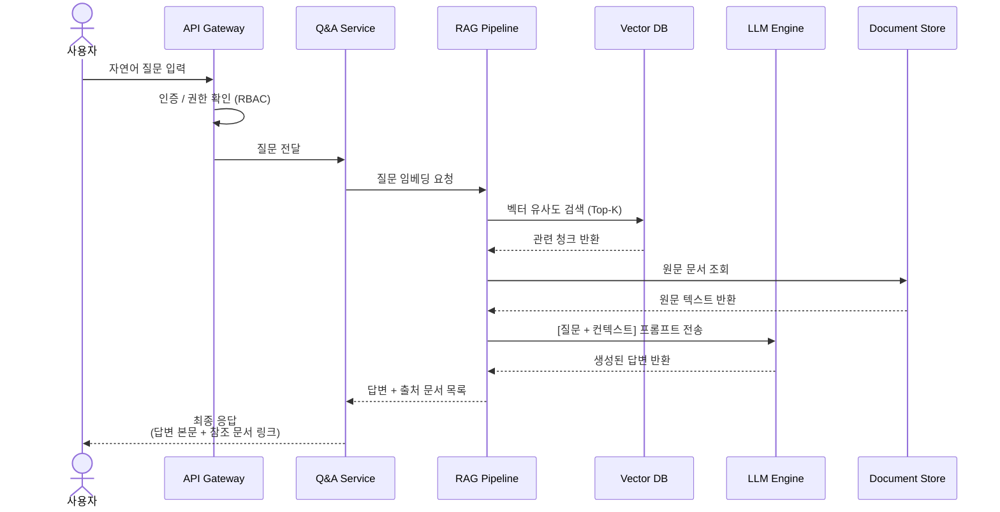

# 데이터 흐름 시퀀스 다이어그램

## 1. 개요

이 문서는 **문서 중앙화 RAG + LLM 기반 질의응답 시스템**에서  
사용자가 자연어 질문을 입력했을 때 내부적으로 어떤 순서로 데이터가 이동하는지를 설명합니다.

주요 흐름은 다음과 같습니다.

1. 사용자가 자연어 질문 입력
2. API Gateway에서 인증 및 권한 확인
3. Q&A Service로 질문 전달
4. RAG Pipeline에서 질문 임베딩 및 Vector DB 검색
5. 관련 문서 원문 조회
6. LLM Engine에 질문과 컨텍스트 전달
7. 답변 생성
8. 사용자에게 답변과 출처 문서 링크 반환

---

## 2. 데이터 흐름 시퀀스 다이어그램



---

## 3. 단계별 설명

### 3.1 사용자 질문 입력

사용자는 웹 브라우저 또는 내부 업무 시스템에서 자연어로 질문을 입력합니다.

예시:

```text
경기주택도시공사 정보화전략계획 ISP 수립 용역과 관련된 회사 문서를 찾아줘.
```

---

### 3.2 API Gateway 인증 / 권한 확인

API Gateway는 사용자의 요청을 가장 먼저 받습니다.

처리 내용:

```text
- 로그인 토큰 확인
- 사용자 권한 확인
- 부서별 접근 가능 문서 범위 확인
- 요청을 Q&A Service로 라우팅
```

RBAC 기반 접근 제어를 적용하면 사용자의 직급, 부서, 역할에 따라 검색 가능한 문서를 제한할 수 있습니다.

---

### 3.3 Q&A Service 질문 전달

Q&A Service는 사용자의 질문을 받아 RAG Pipeline으로 전달합니다.

주요 역할:

```text
- 질문 전처리
- 검색 모드 판단
- RAG Pipeline 호출
- 최종 응답 포맷 정리
```

---

### 3.4 RAG Pipeline 질문 임베딩

RAG Pipeline은 사용자의 질문을 벡터로 변환합니다.

예시:

```text
질문:
"ISP 사업 관련 제안서를 찾아줘"

변환:
[0.123, -0.451, 0.882, ...]
```

이 벡터를 기준으로 Vector DB에서 의미적으로 유사한 문서 청크를 찾습니다.

---

### 3.5 Vector DB 유사도 검색

Vector DB는 질문 벡터와 문서 청크 벡터를 비교해서 관련도가 높은 문서를 반환합니다.

검색 방식:

```text
- Top-K 검색
- 유사도 점수 기준 정렬
- 문서 메타데이터 함께 반환
```

예시 결과:

```text
1. 경기주택도시공사 ISP 제안서.pdf / score: 0.89
2. 정보화전략계획 수행계획서.docx / score: 0.84
3. 공공기관 ISP 유사사업 실적.xlsx / score: 0.77
```

---

### 3.6 원문 문서 조회

검색된 청크만으로 답변을 만들면 문맥이 부족할 수 있습니다.

따라서 RAG Pipeline은 Document Store에서 원문 문서 또는 관련 원문 텍스트를 조회합니다.

Document Store에는 다음 자료가 저장됩니다.

```text
- PDF
- HWP
- DOCX
- Excel
- OCR 추출 텍스트
- 원본 파일 경로
```

---

### 3.7 LLM Engine 답변 생성

RAG Pipeline은 다음 데이터를 LLM Engine에 전달합니다.

```text
- 사용자 질문
- 검색된 문서 청크
- 원문 텍스트 일부
- 문서 제목
- 문서 출처
- 작성일 또는 사업명 메타데이터
```

LLM은 이 정보를 바탕으로 답변을 생성합니다.

---

### 3.8 최종 응답 반환

마지막으로 Q&A Service는 사용자에게 다음 형식으로 응답합니다.

```text
- 답변 본문
- 참조 문서 목록
- 문서 링크
- 유사도 점수
- 문서 위치 또는 페이지 번호
```

예시:

```text
해당 사업과 가장 관련성이 높은 문서는 
'경기주택도시공사 ISP 제안서.pdf'입니다.

참조 문서:
1. 경기주택도시공사 ISP 제안서.pdf
2. 공공기관 ISP 수행계획서.docx
```

---

## 4. 개발 시 구현 포인트

| 구분 | 구현 내용 |
|---|---|
| API Gateway | 로그인 토큰 검증, 권한 확인, 요청 라우팅 |
| Q&A Service | 질문 접수, RAG 호출, 응답 정리 |
| RAG Pipeline | 임베딩, 검색, 프롬프트 구성 |
| Vector DB | 문서 청크 벡터 저장 및 유사도 검색 |
| Document Store | 원문 문서 저장 및 조회 |
| LLM Engine | 컨텍스트 기반 답변 생성 |
| Metadata DB | 문서명, 작성일, 사업명, 카테고리, 권한 정보 저장 |

---

## 5. 개발 우선순위

1차 MVP에서는 아래 순서로 개발하는 것이 좋습니다.

```text
1. 사용자 질문 입력 화면
2. Q&A Service API
3. 문서 업로드 및 텍스트 추출
4. Chunking 처리
5. Embedding 생성
6. Vector DB 저장
7. Top-K 검색
8. LLM 답변 생성
9. 출처 문서 링크 표시
10. 관리자 문서 관리 화면
```

---

## 6. 요약

이 시퀀스 다이어그램은 사용자의 질문이 시스템 내부에서 어떻게 처리되는지를 보여줍니다.

핵심은 다음과 같습니다.

```text
사용자 질문
→ 인증 / 권한 확인
→ 질문 임베딩
→ Vector DB 검색
→ 원문 문서 조회
→ LLM 답변 생성
→ 출처 포함 응답 반환
```

이 구조를 기준으로 개발하면 단순 검색 시스템이 아니라  
**출처 기반 문서 검색 + RAG 질의응답 + LLM Wiki 확장 구조**로 발전시킬 수 있습니다.