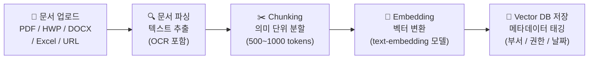

# 문서 등록 파이프라인

## Ingestion Flow

이 다이어그램은 사용자가 문서를 업로드한 후  
시스템 내부에서 문서가 파싱, 청킹, 임베딩, Vector DB 저장까지 처리되는 흐름을 설명합니다.

```mermaid
flowchart LR
    A["📄 문서 업로드\nPDF / HWP / DOCX\n/ Excel / URL"] 
    --> B["🔍 문서 파싱\n텍스트 추출\n(OCR 포함)"]
    --> C["✂️ Chunking\n의미 단위 분할\n(500~1000 tokens)"]
    --> D["🔢 Embedding\n벡터 변환\n(text-embedding 모델)"]
    --> E["💾 Vector DB 저장\n메타데이터 태깅\n(부서 / 권한 / 날짜)"]
```